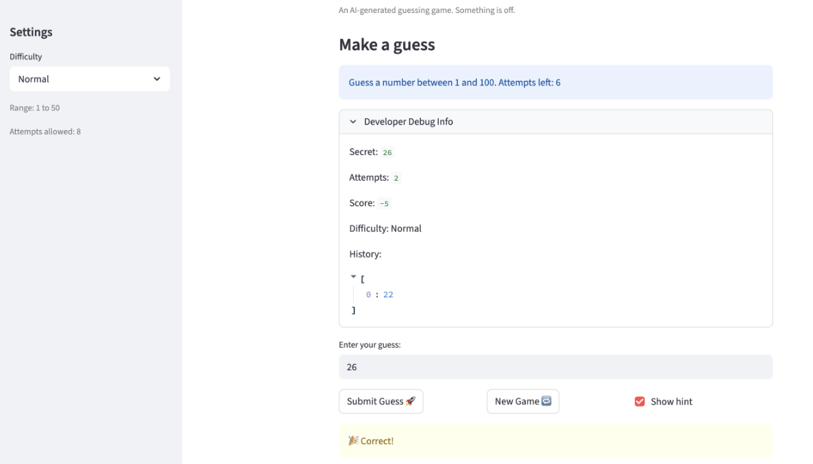

# 🎮 Game Glitch Investigator: The Impossible Guesser

## 🚨 The Situation

You asked an AI to build a simple "Number Guessing Game" using Streamlit.
It wrote the code, ran away, and now the game is unplayable.

- You can't win.
- The hints lie to you.
- The secret number seems to have commitment issues.

## 🛠️ Setup

1. Install dependencies: `pip install -r requirements.txt`
2. Run the broken app: `python -m streamlit run app.py`

## 🕵️‍♂️ Your Mission

1. **Play the game.** Open the "Developer Debug Info" tab in the app to see the secret number. Try to win.
2. **Find the State Bug.** Why does the secret number change every time you click "Submit"? Ask ChatGPT: *"How do I keep a variable from resetting in Streamlit when I click a button?"*
3. **Fix the Logic.** The hints ("Higher/Lower") are wrong. Fix them.
4. **Refactor & Test.** - Move the logic into `logic_utils.py`.
   - Run `pytest` in your terminal.
   - Keep fixing until all tests pass!

## 📝 Document Your Experience

- [x] Describe the game's purpose.
The game is a number-guessing game where the player tries to guess a randomly generated secret number within a limited number of attempts based on the level of difficulty. The player selects a difficulty level (Easy, Normal, or Hard), which determines the range of the secret number and the number of attempts allowed. After each guess, the game gives a hint indicating whether the guess was too high or too low. The user can restart the game once they have exhausted their attempts or if they win.

- [x] Detail which bugs you found.
1. Difficulty ranges were swapped: Normal mode used a range of 1–100 and Hard mode used 1–50, when it should be the other way around (Normal: 1–50, Hard: 1–100).
2. Hints were reversed: When the guess was too high, the game told the player to "Go HIGHER!" and when too low it said "Go LOWER!" — both messages were pointing in the wrong direction.
3. Attempt values: On launch in the debugger section, the attempt value is set to 1, but in a new game, it is set to 0.
4. Out of range values as input: The game accepted values greater than 100 as input, even though the range was 1–100.

- [x] Explain what fixes you applied.
1. Fixed difficulty ranges in the get_range_for_difficulty method: swapped the return values so Normal returns `1, 50` and Hard returns `1, 100`.
2. Fixed hint messages in check_guess method: when `guess > secret`, the message now correctly says "Go LOWER!", and when `guess < secret`, it says "Go HIGHER!".
3. Refactored logic into logic_utils.py: moved `check_guess`, `parse_guess`, and `get_range_for_difficulty` out of `app.py` and into `logic_utils.py`, then updated `app.py` to import them from there.
4. Added tests in tests/test_game_logic.py to verify the corrected difficulty ranges and hint direction.

## 📸 Demo

- [ ] [Insert a screenshot of your fixed, winning game here]

!## 📸 Demo

## 🚀 Stretch Features

- [ ] [If you choose to complete Challenge 4, insert a screenshot of your Enhanced Game UI here]
- [ ] [If you completed Challenge 1: Advanced Edge-Case Testing, include a screenshot of your pytest results in the README showing the tests passing.]
